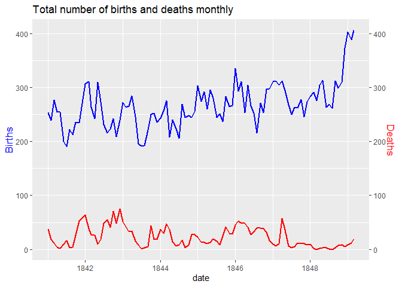
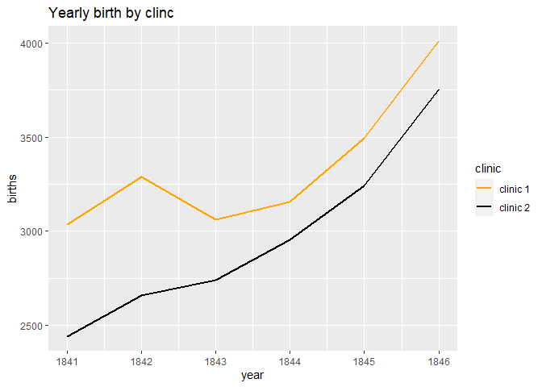
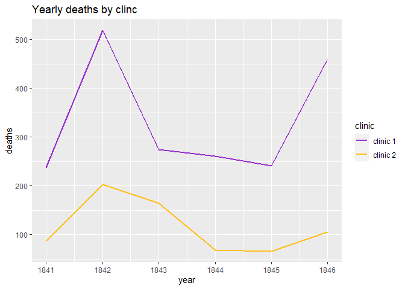
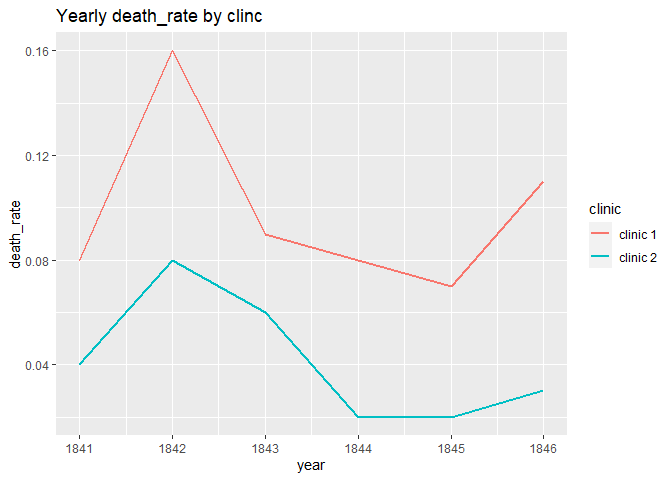
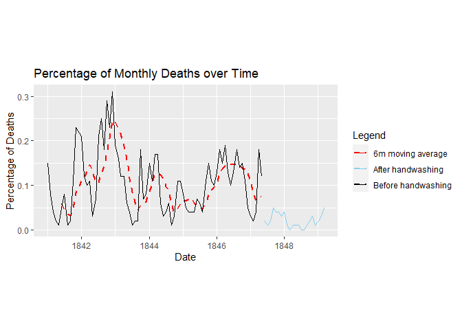
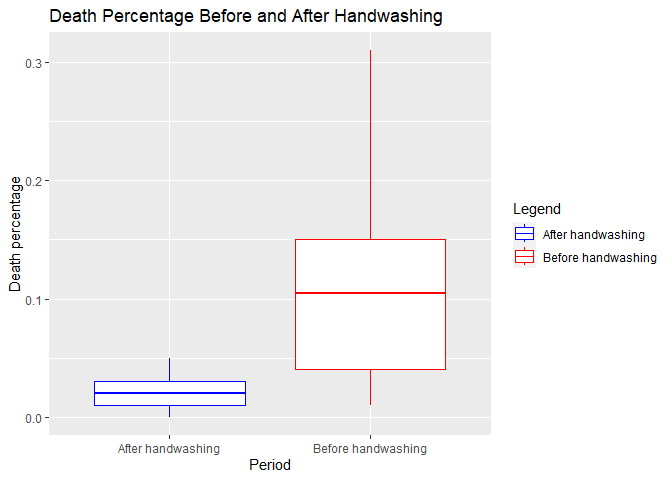
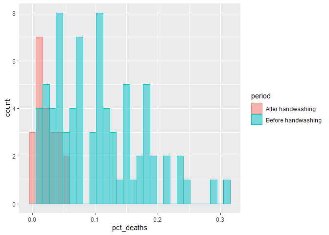
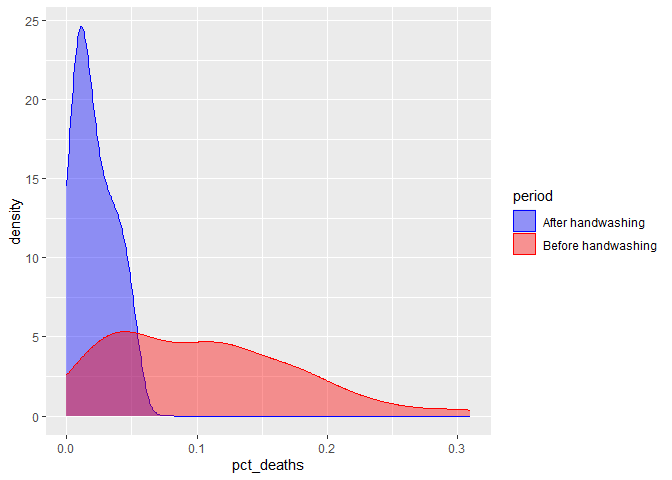

Dr Semmelweis Analysis
================
Heng KongkeaOudong
January 08 2024

# Setup and Context

## Introduction

Dr Ignaz Semmelweis was a Hungarian physician born in 1818 who worked in
the Vienna General Hospital. In the past people thought of illness as
caused by “bad air” or evil spirits. But in the 1800s Doctors started
looking more at anatomy, doing autopsies and started making arguments
based on data. Dr Semmelweis suspected that something was going wrong
with the procedures at Vienna General Hospital. Semmelweis wanted to
figure out why so many women in maternity wards were dying from childbed
fever (i.e., [puerperal
fever](https://en.wikipedia.org/wiki/Postpartum_infections)).

Today we will become Dr Semmelweis. We will step into Dr Semmelweis’
shoes and analyse the same data collected from 1841 to 1849.

## The Data Source

Dr Semmelweis published his research in 1861. [full text with the
original tables in
German](http://www.deutschestextarchiv.de/book/show/semmelweis_kindbettfieber_1861),
[English translation can be found
here](http://graphics8.nytimes.com/images/blogs/freakonomics/pdf/the%20etiology,%20concept%20and%20prophylaxis%20of%20childbed%20fever.pdf).

## Libraries

``` r
library(dplyr)
```

    ## 
    ## Attaching package: 'dplyr'

    ## The following objects are masked from 'package:stats':
    ## 
    ##     filter, lag

    ## The following objects are masked from 'package:base':
    ## 
    ##     intersect, setdiff, setequal, union

``` r
library(tidyverse)  
```

    ## ── Attaching core tidyverse packages ──────────────────────── tidyverse 2.0.0 ──
    ## ✔ forcats   1.0.0     ✔ readr     2.1.4
    ## ✔ ggplot2   3.4.3     ✔ stringr   1.5.0
    ## ✔ lubridate 1.9.2     ✔ tibble    3.2.1
    ## ✔ purrr     1.0.1     ✔ tidyr     1.3.0

    ## ── Conflicts ────────────────────────────────────────── tidyverse_conflicts() ──
    ## ✖ dplyr::filter() masks stats::filter()
    ## ✖ dplyr::lag()    masks stats::lag()
    ## ℹ Use the conflicted package (<http://conflicted.r-lib.org/>) to force all conflicts to become errors

``` r
library(lubridate)  
library(ggplot2)
library(readr)
library(stringr)
library(viridis)
```

    ## Warning: package 'viridis' was built under R version 4.3.2

    ## Loading required package: viridisLite

``` r
library(tibbletime)
```

    ## Warning: package 'tibbletime' was built under R version 4.3.2

    ## 
    ## Attaching package: 'tibbletime'
    ## 
    ## The following object is masked from 'package:stats':
    ## 
    ##     filter

## Read the data

``` r
monthly_df <- read_csv('monthly_deaths.csv')
```

    ## Rows: 98 Columns: 3
    ## ── Column specification ────────────────────────────────────────────────────────
    ## Delimiter: ","
    ## dbl  (2): births, deaths
    ## date (1): date
    ## 
    ## ℹ Use `spec()` to retrieve the full column specification for this data.
    ## ℹ Specify the column types or set `show_col_types = FALSE` to quiet this message.

``` r
yearly_df <- read_csv('annual_deaths_by_clinic.csv')
```

    ## Rows: 12 Columns: 4
    ## ── Column specification ────────────────────────────────────────────────────────
    ## Delimiter: ","
    ## chr (1): clinic
    ## dbl (3): year, births, deaths
    ## 
    ## ℹ Use `spec()` to retrieve the full column specification for this data.
    ## ℹ Specify the column types or set `show_col_types = FALSE` to quiet this message.

# Preliminary Data Exploration

Check out these two DataFrames.

- What is the shape of yearly_df and monthly_df? How many rows and
  columns?
- What are the column names?
- Which years are included in the dataset?
- Are there any NaN values or duplicates?
- What were the average number of births that took place per month?
- What were the average number of deaths that took place per month?

## Yearly dataframe

``` r
yearly_df
```

    ## # A tibble: 12 × 4
    ##     year births deaths clinic  
    ##    <dbl>  <dbl>  <dbl> <chr>   
    ##  1  1841   3036    237 clinic 1
    ##  2  1842   3287    518 clinic 1
    ##  3  1843   3060    274 clinic 1
    ##  4  1844   3157    260 clinic 1
    ##  5  1845   3492    241 clinic 1
    ##  6  1846   4010    459 clinic 1
    ##  7  1841   2442     86 clinic 2
    ##  8  1842   2659    202 clinic 2
    ##  9  1843   2739    164 clinic 2
    ## 10  1844   2956     68 clinic 2
    ## 11  1845   3241     66 clinic 2
    ## 12  1846   3754    105 clinic 2

``` r
is.null(yearly_df)
```

    ## [1] FALSE

``` r
sum(duplicated(yearly_df))
```

    ## [1] 0

``` r
summary(yearly_df)
```

    ##       year          births         deaths         clinic         
    ##  Min.   :1841   Min.   :2442   Min.   : 66.0   Length:12         
    ##  1st Qu.:1842   1st Qu.:2902   1st Qu.:100.2   Class :character  
    ##  Median :1844   Median :3108   Median :219.5   Mode  :character  
    ##  Mean   :1844   Mean   :3153   Mean   :223.3                     
    ##  3rd Qu.:1845   3rd Qu.:3338   3rd Qu.:263.5                     
    ##  Max.   :1846   Max.   :4010   Max.   :518.0

**Insight**: The `yearly_df` is cleaned, with no missing values or
duplicates. The average annual births and deaths are 3153 and 223,
respectively.

## Monthly dataframe

``` r
monthly_df
```

    ## # A tibble: 98 × 3
    ##    date       births deaths
    ##    <date>      <dbl>  <dbl>
    ##  1 1841-01-01    254     37
    ##  2 1841-02-01    239     18
    ##  3 1841-03-01    277     12
    ##  4 1841-04-01    255      4
    ##  5 1841-05-01    255      2
    ##  6 1841-06-01    200     10
    ##  7 1841-07-01    190     16
    ##  8 1841-08-01    222      3
    ##  9 1841-09-01    213      4
    ## 10 1841-10-01    236     26
    ## # ℹ 88 more rows

``` r
is.null(monthly_df)
```

    ## [1] FALSE

``` r
sum(duplicated(monthly_df))
```

    ## [1] 0

``` r
summary(monthly_df)
```

    ##       date                births          deaths     
    ##  Min.   :1841-01-01   Min.   :190.0   Min.   : 0.00  
    ##  1st Qu.:1843-02-08   1st Qu.:242.5   1st Qu.: 8.00  
    ##  Median :1845-02-15   Median :264.0   Median :16.50  
    ##  Mean   :1845-02-11   Mean   :267.0   Mean   :22.47  
    ##  3rd Qu.:1847-02-22   3rd Qu.:292.8   3rd Qu.:36.75  
    ##  Max.   :1849-03-01   Max.   :406.0   Max.   :75.00

**Insight**: The `monthly_df` is also cleaned. In the monthly time
frame, the average births and deaths are 267 and about 22, respectively.

# Percentage of Women Dying in Childbirth

How dangerous was childbirth in the 1840s in Vienna?

In comparison, the United States recorded 18.5 maternal deaths per
100,000 or 0.018% in 2013
[(source).](https://en.wikipedia.org/wiki/Maternal_death#:~:text=The%20US%20has%20the%20%22highest,17.8%20per%20100%2C000%20in%202009)

``` r
total_death <- sum(yearly_df$deaths)
total_birth <- sum(yearly_df$births)
death_rate <- (total_death/total_birth)*100
sprintf("The death rate in the 1840s in Vienna is: %.3f percent.", death_rate)
```

    ## [1] "The death rate in the 1840s in Vienna is: 7.084 percent."

**Insight:** The general mortality rate of women in childbirth during
the 1840s was a staggering 7.08%, which is significantly higher than the
2013 United States maternal death rate of only 0.018%. This implies that
for every 100 women giving birth, 7 faced mortality each year.

# Visualise the Total Number of Births 🤱 and Deaths 💀 over Time

``` r
ggplot(monthly_df, aes(x=date)) +
  geom_line(aes(y=births), linewidth = 1, color = "Blue") + 
  geom_line(aes(y=deaths), linewidth = 1, color = "Red") + 
  labs(title = "Total number of births and deaths monthly")+ 
  scale_y_continuous(
    
    # Features of the first axis
    name = "Births",
    
    # Add a second axis and specify its features
    sec.axis = sec_axis(~., name="Deaths")) +  
  theme(
    axis.title.y = element_text(color = "Blue", size=13),
    axis.title.y.right = element_text(color = "Red", size=13)
  ) 
```

<!-- -->
<br/>**Insight:** What stands out here is that from 1841 to 1847, the
number of monthly deaths appears to be relatively high. After 1847,
there was a sharp increase in deaths initially, but this was followed by
a significant decrease, leading to a consistently low death rate ever
since which indicating that something might have occurred to cause this
decline. It’s also important to noted that after the significant drop in
death rate, we observed that the number of births on the other hand
skyrocketed.

# The Yearly Data Split by Clinic

Now let’s look at the annual data instead.

- Which clinic is bigger or more busy judging by the number of births?
- Has the hospital had more patients over time?
- What was the highest number of deaths recorded in clinic 1 and clinic
  2?

``` r
yearly_df
```

    ## # A tibble: 12 × 4
    ##     year births deaths clinic  
    ##    <dbl>  <dbl>  <dbl> <chr>   
    ##  1  1841   3036    237 clinic 1
    ##  2  1842   3287    518 clinic 1
    ##  3  1843   3060    274 clinic 1
    ##  4  1844   3157    260 clinic 1
    ##  5  1845   3492    241 clinic 1
    ##  6  1846   4010    459 clinic 1
    ##  7  1841   2442     86 clinic 2
    ##  8  1842   2659    202 clinic 2
    ##  9  1843   2739    164 clinic 2
    ## 10  1844   2956     68 clinic 2
    ## 11  1845   3241     66 clinic 2
    ## 12  1846   3754    105 clinic 2

## Yearly birth split by clinic

``` r
ggplot(yearly_df, aes(x=year, y = births, color = clinic)) + 
  geom_line(linewidth=1) +
  labs(title = "Yearly birth by clinc")+
  scale_color_manual(values=c("orange", "black"))
```

<!-- -->
<br/> **Insight**: Overall, it is evident that there is an increase
number of women are giving birth to children overtime and additionally,
we see that Clinic 1 appears to be the busier than Clinic 2. \## Yearly
deaths by clinic

``` r
ggplot(yearly_df, aes(x=year, y = deaths, color = clinic)) + 
  geom_line(linewidth=1) +
  labs(title = "Yearly deaths by clinc") +
  scale_color_manual(values=c("darkorchid3", "goldenrod1"))
```

<!-- -->
<br/>**Insight**: Clinic 2 has fewer deaths compared to Clinic 1, which
is likely because Clinic 1 handles more patients. To better understand
this, we should analyze the ratio of deaths to births at both clinics.

## Calculate the Proportion of Deaths at Each Clinic

``` r
yearly_df <- yearly_df %>% 
  mutate(death_rate = round(deaths/births, 2))
yearly_df
```

    ## # A tibble: 12 × 5
    ##     year births deaths clinic   death_rate
    ##    <dbl>  <dbl>  <dbl> <chr>         <dbl>
    ##  1  1841   3036    237 clinic 1       0.08
    ##  2  1842   3287    518 clinic 1       0.16
    ##  3  1843   3060    274 clinic 1       0.09
    ##  4  1844   3157    260 clinic 1       0.08
    ##  5  1845   3492    241 clinic 1       0.07
    ##  6  1846   4010    459 clinic 1       0.11
    ##  7  1841   2442     86 clinic 2       0.04
    ##  8  1842   2659    202 clinic 2       0.08
    ##  9  1843   2739    164 clinic 2       0.06
    ## 10  1844   2956     68 clinic 2       0.02
    ## 11  1845   3241     66 clinic 2       0.02
    ## 12  1846   3754    105 clinic 2       0.03

``` r
yearly_df %>% 
  group_by(clinic) %>% 
  summarise(average_death = round(mean(death_rate),2))
```

    ## # A tibble: 2 × 2
    ##   clinic   average_death
    ##   <chr>            <dbl>
    ## 1 clinic 1          0.1 
    ## 2 clinic 2          0.04

<br/>**Insight**: Now we can confidently say that, clinic 2 are safer
considering the low average death rate of only 4% compare to clinic 1
10%.

``` r
ggplot(yearly_df, aes(x=year, y = death_rate, color = clinic)) + 
  geom_line(linewidth=1) +
  labs(title = "Yearly death_rate by clinc")
```

<!-- -->
<br/>**Insight:** It is evident that in 1842, the death rate was at its
peak, with Clinic 1 recording a total death rate of over 15% and Clinic
2 at 7.5%. Further research on the internet suggests that during the
1840s, doctors and medical students were not as hygienic during
autopsies, allowing diseases from the remains and particles of the
corpse to transfer to women giving birth. This breakthrough allow
Semmelweis to realised that the majority of the deaths in both clinics
were not only cause by women giving birth but also transmitted disease.

# Major Breakthrough

After the discovery, in June 1847, Dr. Semmelweis mandated that every
member of his medical staff begin cleaning their hands and instruments
not only with soap and water but also with a chlorine solution after an
autopsy. \## The Effect of Handwashing

``` r
handwashing_start <- as.Date("1847-06-01", format = "%Y-%m-%d")
```

Adding a column called “pct_deaths” to `monthly_df` that has the
percentage of deaths per birth for each row.

``` r
monthly_df <- monthly_df %>% 
  mutate(pct_deaths = round(deaths/births, 2))
monthly_df
```

    ## # A tibble: 98 × 4
    ##    date       births deaths pct_deaths
    ##    <date>      <dbl>  <dbl>      <dbl>
    ##  1 1841-01-01    254     37       0.15
    ##  2 1841-02-01    239     18       0.08
    ##  3 1841-03-01    277     12       0.04
    ##  4 1841-04-01    255      4       0.02
    ##  5 1841-05-01    255      2       0.01
    ##  6 1841-06-01    200     10       0.05
    ##  7 1841-07-01    190     16       0.08
    ##  8 1841-08-01    222      3       0.01
    ##  9 1841-09-01    213      4       0.02
    ## 10 1841-10-01    236     26       0.11
    ## # ℹ 88 more rows

Creating two subsets from the `monthly_df` data: before and after Dr
Semmelweis ordered washing hand.

``` r
before_handwashing <- monthly_df[monthly_df$date < handwashing_start,]
after_handwashing <- monthly_df[monthly_df$date >= handwashing_start,]
```

Calculating the average death rate prior to June 1947 and the average
death rate after June 1947.

``` r
before_hw_rate = (sum(before_handwashing$deaths)/sum(before_handwashing$births))*100
after_hw_rate = (sum(after_handwashing$deaths)/sum(after_handwashing$births))*100
sprintf("Before the handwashing madatory the death rate was %.2f percentage.", before_hw_rate)
```

    ## [1] "Before the handwashing madatory the death rate was 10.53 percentage."

``` r
sprintf("After the handwashing madatory the death rate was %.2f percentage.", after_hw_rate)
```

    ## [1] "After the handwashing madatory the death rate was 2.15 percentage."

<br/>**Insight**: Wow, the hand washing mandatory worked. The mortality
rate dropped by roughly a factor of 5 from 10.53% to 2.15%.

# Calculate a Rolling Average of the Death Rate

``` r
rolling_mean <- rollify(mean, window = 6)
before_handwashing <- before_handwashing %>% 
  mutate(
    pct_ma = rolling_mean(pct_deaths)
  )
combined_data <- bind_rows(
  before_handwashing %>% mutate(period = "Before handwashing"),
  after_handwashing %>% mutate(period = "After handwashing")
)
```

## Ploting the differences

``` r
ggplot(combined_data, aes(x= date, y = pct_deaths)) +
  geom_line(data = before_handwashing, aes(y=pct_ma, color = "6m moving average"), linetype = "dashed", linewidth=1,)+
  geom_line(aes(color = period), linewidth = 0.7) + 
  scale_color_manual(values = c(
    "Before handwashing" = "black",
    "After handwashing" = "skyblue",
    "6m moving average" = "red"
  )) + 
  labs(title = "Percentage of Monthly Deaths over Time",
       x = "Date",
       y = "Percentage of Deaths",
       color = "Legend")+
  theme(aspect.ratio = 1/2)
```

    ## Warning: Removed 5 rows containing missing values (`geom_line()`).

<!-- -->
<br/> \## Use Box Plots to Show How the Death Rate Changed Before and
After Handwashing

How did key statistics like the mean, max, min, 1st and 3rd quartile
changed as a result of the new policy?

``` r
ggplot(combined_data, aes(x = period, y = pct_deaths, color = period)) +
  geom_boxplot() + 
  labs(title = "Death Percentage Before and After Handwashing",
       x = "Period",
       y = "Death percentage",
       color = "Legend") + 
  scale_color_manual(values = c(
    "After handwashing" = "blue",
    "Before handwashing" = "red"
  ))
```

<!-- -->
<br/>**Insight:** This boxplot offers a distinct perspective on how
handwashing influences the death rate of women in the 1840s. Upon
comparing the two boxplots, it becomes evident that the first one
depicts a substantial spike in the death rate, exceeding 30%, occurring
in 1842. This boxplot features a large body and long whiskers,
indicating significant fluctuations in the death rate of women in the
absence of handwashing. In contrast, after the introduction of
handwashing, the second boxplot is noticeably smaller with shorter
whiskers. This boxplot suggests that with the implementation of
handwashing, the averages, maximums, and minimums decrease
significantly, resulting in greater overall stability. \## Use
Histograms to Visualise the Monthly Distribution of Outcomes

``` r
ggplot(combined_data, aes(x = pct_deaths, fill = period, color = period)) + 
  geom_histogram(
    bins = 30,
    alpha = 0.5,
    position="identity"
  )
```

<!-- -->
<br/>**Insight:** Due to the limitation of our data, our histogram look
a bit jagged. However, we can estimate what the distribution would look
like with a Kernel Density Estimate (KDE). \## Use a Kernel Density
Estimate (KDE) to visualise a smooth distribution

``` r
ggplot(combined_data, aes(x=pct_deaths, fill=period, color=period)) + 
  geom_density(alpha=0.4) + 
  scale_color_manual(values = c(
    "After handwashing" = "blue",
    "Before handwashing" = "red"
  )) +
  scale_fill_manual(values = c(
    "After handwashing" = "blue",
    "Before handwashing" = "red"
  ))
```

<!-- -->
<br/>**Insight:** Now, it’s easier and clearer to confirm that for
handwashing, the distribution of the death rate is more skewed to the
right compared to the flatter distribution observed in the absence of
handwashing. This further reinforces our argument in favor of
handwashing. \# Use a T-Test to Show Statistical Significance Lastly, we
want to statistical confirm that the 8.4% decrease in the overall
mortality rate isn’t just happen purely by chance but actually
statistically significant (meaning that the difference was had by the
introduction of handwashing).

``` r
t.test(before_handwashing$pct_deaths, after_handwashing$pct_deaths)
```

    ## 
    ##  Welch Two Sample t-test
    ## 
    ## data:  before_handwashing$pct_deaths and after_handwashing$pct_deaths
    ## t = 9.5827, df = 93.195, p-value = 1.532e-15
    ## alternative hypothesis: true difference in means is not equal to 0
    ## 95 percent confidence interval:
    ##  0.0663525 0.1010398
    ## sample estimates:
    ##  mean of x  mean of y 
    ## 0.10460526 0.02090909

**Insight:** With a p-value of 1.532e-15 which is an extremely small
value. Thus, we can confidently state that we are 99% certain that the
difference brought about by introducing handwashing is not merely a
random occurrence but is statistically significant.
